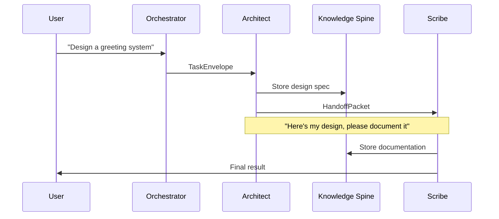

# 🚀 Getting Started with ENVY - Production Ready

## What You Have Now

A **complete, production-ready AI system** with:

✅ **Polymorphic Companion** - Single AI persona that morphs into any expert needed  
✅ **Multi-Agent Orchestration** - 6 specialized agents working together  
✅ **Knowledge Spine** - Persistent memory across all interactions  
✅ **Baton-Passing** - Agents hand off work with context  
✅ **Digital Twin Framework** - Autonomous AI that acts as you  
✅ **n8n Integration** - Visual workflow automation  
✅ **Claude-like UI** - Streaming chat with artifact rendering  
✅ **No Authentication** - 100% open source, no sign-up required  

---

## Quick Start (2 minutes)

### 1. Install Dependencies

```bash
pip install -r requirements.txt
```

### 2. Set API Key

Get a free API key from [Groq](https://console.groq.com) (fastest) or [OpenRouter](https://openrouter.ai):

```bash
export GROQ_API_KEY="your_key_here"
# OR
export OPENROUTER_API_KEY="your_key_here"
```

### 3. Start the Server

```bash
python server.py
```

### 4. Open Browser

Navigate to: **http://localhost:8000**

You're done! Start chatting with ENVY.

---

## System Architecture

### The Polymorphic Companion

ENVY uses a **single Polymorphic Companion** persona that can morph into any expert:

- **Architect**: System design & specifications
- **Scribe**: Documentation & summaries
- **Builder**: Code implementation
- **Curator**: Knowledge management
- **Guardian**: Safety & validation
- **Continuity**: Memory & legacy

Instead of loading 9 separate personas, the Polymorphic Companion **adapts** to your needs dynamically.

### Multi-Agent Orchestration

```
┌─────────────────────────────────────────────┐
│          Orchestrator                        │
│  (Routes tasks to appropriate agents)        │
└──────────────────┬──────────────────────────┘
                   │
      ┌────────────┼────────────┐
      │            │            │
┌─────▼────┐ ┌────▼────┐ ┌────▼────┐
│Architect │ │ Scribe  │ │ Builder │
│  Agent   │ │  Agent  │ │  Agent  │
└─────┬────┘ └────┬────┘ └────┬────┘
      │           │           │
      └───────────┼───────────┘
                  │
          ┌───────▼────────┐
          │ Knowledge Spine │
          │ (Shared Memory) │
          └─────────────────┘
```

### Task Flow with Baton-Passing



---

## Core Concepts

### 1. Task Envelopes

Every task follows a standard structure:

```python
from envy.orchestration.protocols import TaskEnvelope

task = TaskEnvelope(
    origin="human",
    project_id="my-project",
    instruction="Design a user authentication system",
    expected_output_type="spec",
    downstream_agent="architect"
)
```

### 2. Handoff Packets

Agents pass work with context:

```python
from envy.orchestration.protocols import HandoffPacket

handoff = HandoffPacket(
    from_agent="architect",
    to_agent="builder",
    project_id="my-project",
    summary="Auth system designed with JWT tokens",
    artifacts=["doc://auth-spec"],
    narrative_note="I've designed the auth flow. Key decision: use JWT over sessions for scalability."
)
```

### 3. Knowledge Spine

Persistent storage for everything:

```python
from envy.orchestration.knowledge_spine import KnowledgeSpine

spine = KnowledgeSpine()

# Create project
project = spine.create_project(
    project_id="my-app",
    name="My Application",
    mission="Build a scalable web app"
)

# Store decision
from envy.orchestration.protocols import Decision

decision = Decision(
    project_id="my-app",
    context="Choosing database",
    options_considered=["PostgreSQL", "MongoDB", "SQLite"],
    chosen_option="PostgreSQL",
    rationale="Better for relational data and ACID compliance"
)
spine.log_decision(decision)
```

### 4. Digital Twin (Architected Self)

Create an AI that acts as you:

```python
from envy.orchestration.architected_self import create_digital_twin

twin = create_digital_twin(
    user_name="Nathan",
    user_id="nathan-001",
    communication_style="direct, no-nonsense, uses slang",
    expertise_areas=["AI", "startups", "mental health"],
    llm_client=llm,
    knowledge_spine=spine
)

# Run autonomous loop
await twin.autonomous_loop(goal="Research AI safety frameworks")
```

---

## Advanced Usage

### Integrate with n8n Workflows

The system includes n8n integration for visual workflow automation:

```python
from envy.orchestration.n8n_integration import N8nOrchestrator

n8n = N8nOrchestrator(
    knowledge_spine=spine,
    orchestrator=orchestrator,
    n8n_base_url="http://localhost:5678"
)

# Handle webhook from n8n
result = await n8n.handle_webhook(webhook_request)
```

Export node definitions:

```bash
python -c "
from envy.orchestration.n8n_integration import export_node_definitions
import json
print(json.dumps(export_node_definitions(), indent=2))
" > n8n_nodes.json
```

### Programmatic Chat

```python
import asyncio
from envy.agent import ENVY

async def chat():
    async with ENVY() as envy:
        response = await envy.chat("Explain quantum computing")
        print(response.content)

asyncio.run(chat())
```

### CLI Interface

```bash
python chat.py
```

Commands:
- `/personas` - List available personas
- `/stats` - Show usage statistics
- `/remember <text>` - Store in memory
- `/recall <query>` - Search memory
- `/quit` - Exit

---

## API Endpoints

### Health Check
```bash
curl http://localhost:8000/health
```

### Chat (Streaming)
```bash
curl -X POST http://localhost:8000/v1/chat/completions/stream \
  -H "Content-Type: application/json" \
  -d '{
    "model": "envy",
    "messages": [{"role": "user", "content": "Hello!"}],
    "stream": true
  }'
```

### List Personas
```bash
curl http://localhost:8000/api/personas
```

---

## Environment Variables

| Variable | Required | Description |
|----------|----------|-------------|
| `GROQ_API_KEY` | Yes* | Groq API key (free tier available) |
| `OPENROUTER_API_KEY` | Yes* | OpenRouter API key (fallback) |
| `SUPABASE_URL` | No | Supabase URL for cloud memory |
| `SUPABASE_ANON_KEY` | No | Supabase anonymous key |
| `PORT` | No | Server port (default: 8000) |

*At least one LLM provider required

---

## Deployment

### Deploy to Render

1. Connect your GitHub repo to Render
2. Set environment variables in Render dashboard
3. Deploy automatically from `server.py`

### Deploy to Fly.io

```bash
fly launch
fly secrets set GROQ_API_KEY=your_key
fly deploy
```

### Deploy with Docker

```bash
docker build -t envy .
docker run -p 8000:8000 -e GROQ_API_KEY=your_key envy
```

---

## Troubleshooting

### "No LLM provider configured"

**Solution**: Set `GROQ_API_KEY` or `OPENROUTER_API_KEY` environment variable.

```bash
export GROQ_API_KEY="gsk_..."
```

### "Port 8000 already in use"

**Solution**: Change the port:

```bash
PORT=8080 python server.py
```

### Memory/Knowledge Spine Not Persisting

**Solution**: Knowledge Spine uses `./memory/knowledge_spine/` by default. Make sure the directory is writable.

```bash
mkdir -p memory/knowledge_spine
chmod 755 memory/knowledge_spine
```

---

## What's Next?

### Immediate Improvements
- [ ] Add file upload to frontend
- [ ] Implement conversation history sidebar
- [ ] Add project/workspace management UI
- [ ] Integrate code execution sandbox

### Advanced Features
- [ ] Voice chat with TTS/STT
- [ ] Avatar animation
- [ ] Collaborative workspaces
- [ ] RAG with document ingestion

---

## Getting Help

- **Documentation**: See `/envy/docs/` for detailed frameworks
- **Issues**: GitHub Issues for bugs and feature requests
- **Community**: Discord (coming soon)

---

## License

MIT License - Use freely, with love.

Built by ENVY for Nathan Ray Michel (@claudenunc)  
Mission: Heaven on Earth
