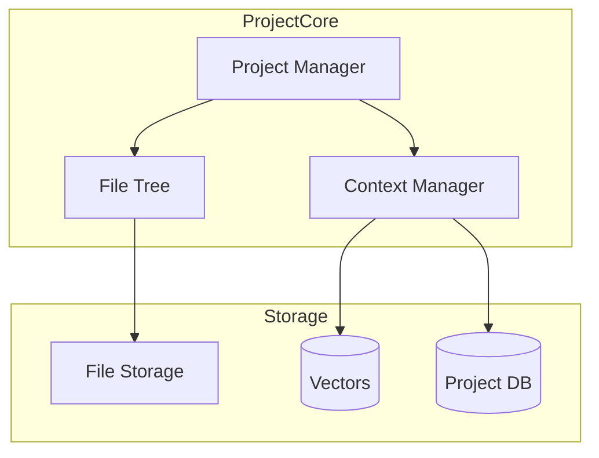
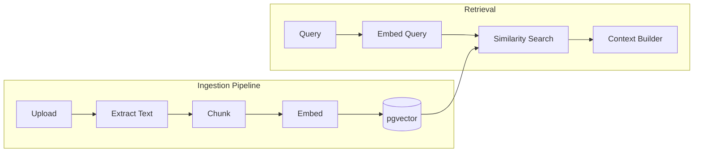
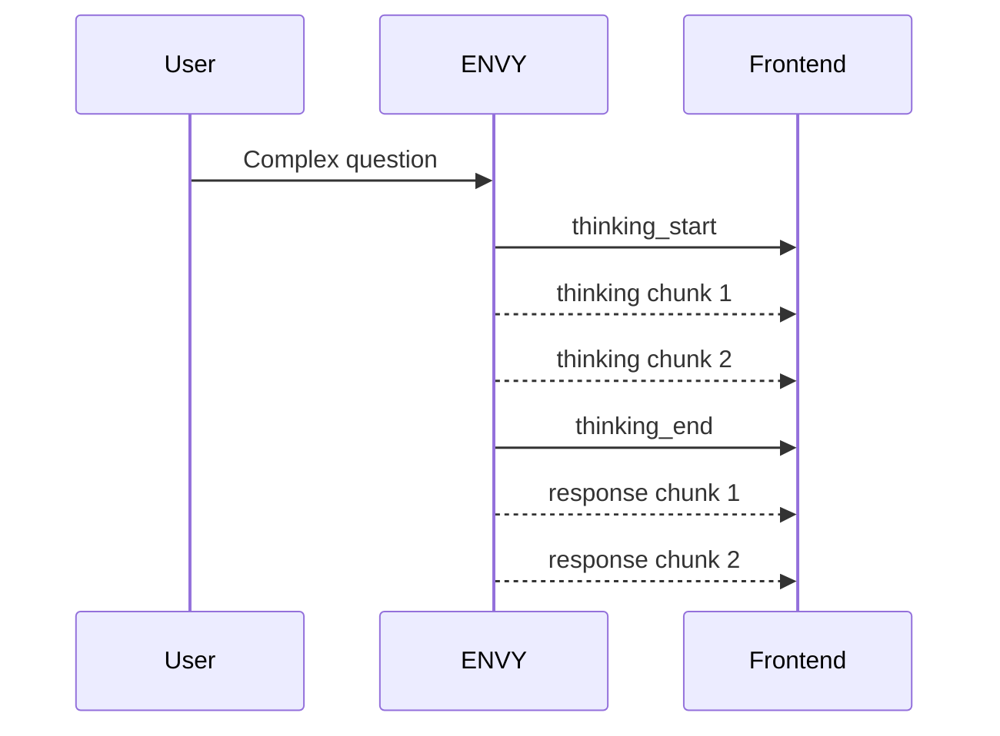
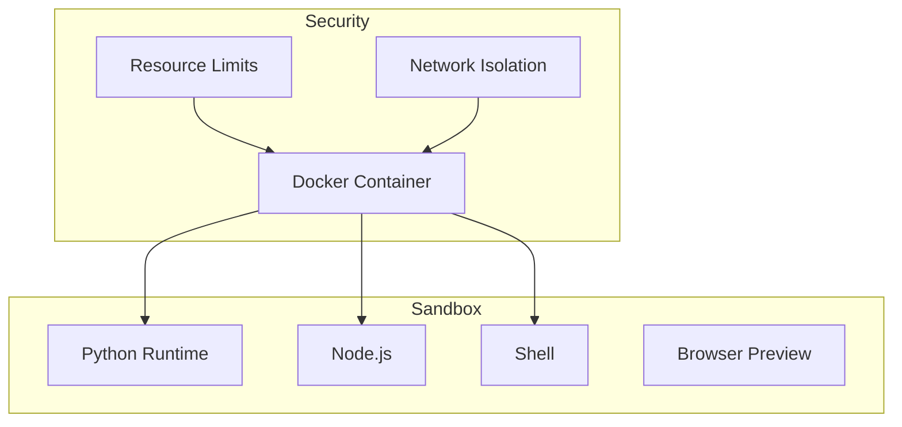
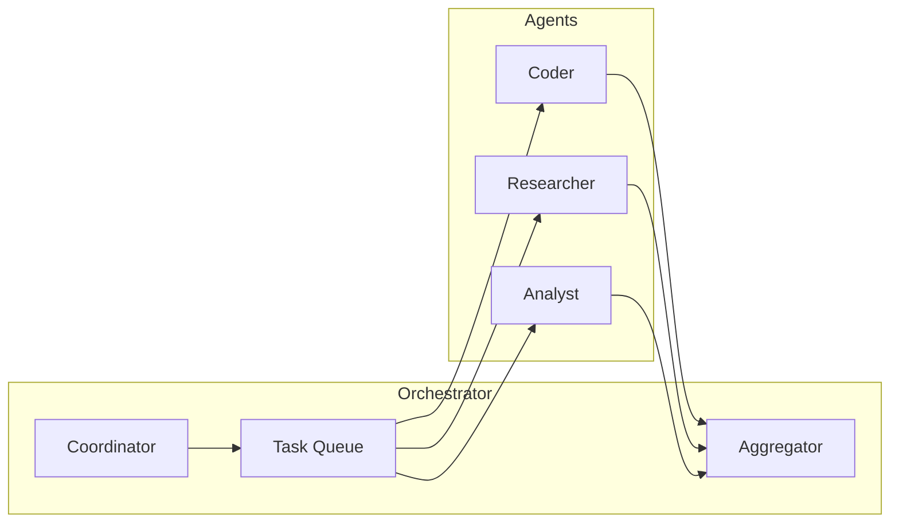
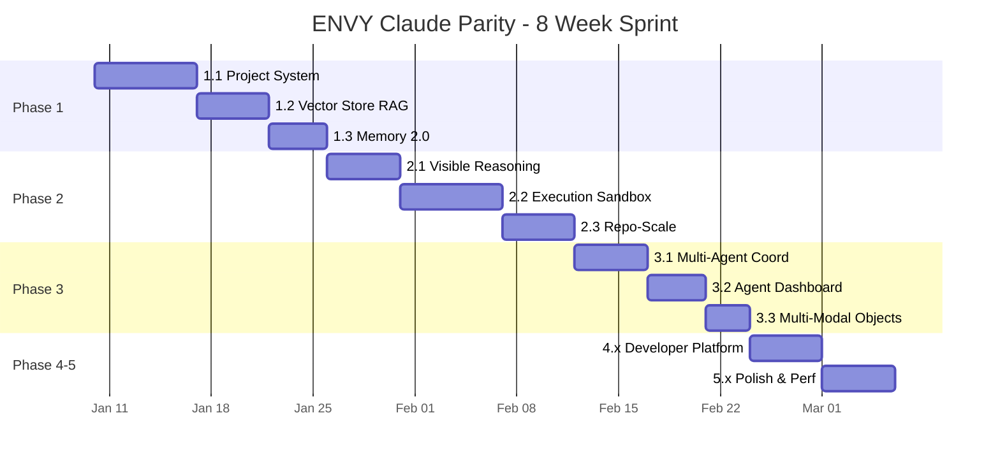

# ENVY → Claude.ai Feature Parity Roadmap v2.0

## Executive Summary

This roadmap transforms ENVY from a capable v6.0 chat agent into a **Claude.ai-equivalent autonomous workspace**. Organized into 5 strategic phases with clear deliverables.

---

## The Big Three (Why They Matter)

| Feature | Why It Matters |
|---------|---------------|
| **Persistent Projects** | Enables Claude-like workspace continuity |
| **Vector Store RAG** | Enables understanding of entire codebases/documents |
| **Visible Thinking** | Builds trust and enables debugging |

---

## Phase 1: Core Intelligence Layer

### 1.1 Persistent Projects System
**Status:** 🔴 Not Started  
**Priority:** CRITICAL

Transform ENVY from session-based to project-based thinking.



**Deliverables:**
- [ ] `envy/projects/project_manager.py` - CRUD operations for projects
- [ ] `envy/projects/file_tree.py` - Multi-file directory management
- [ ] Database schema: `projects`, `project_files`, `project_settings`
- [ ] API: `POST/GET/PUT/DELETE /api/projects`
- [ ] API: `GET /api/projects/{id}/files`, `POST /api/projects/{id}/files`
- [ ] Frontend: Project selector dropdown, file tree sidebar

**Data Model:**
```python
@dataclass
class Project:
    id: str
    name: str
    description: str
    root_path: str  # Virtual path
    files: Dict[str, ProjectFile]
    settings: ProjectSettings
    context_snapshot: List[str]  # Pre-computed relevant context
    created_at: datetime
    updated_at: datetime
```

---

### 1.2 Vector Store + RAG Infrastructure
**Status:** 🔴 Not Started  
**Priority:** CRITICAL

Enable Claude-like understanding of large documents and codebases.



**Deliverables:**
- [ ] `envy/memory/vector_store.py` - pgvector wrapper
- [ ] `envy/memory/chunker.py` - Smart chunking with overlap
- [ ] `envy/memory/embedder.py` - OpenAI/local embedding support
- [ ] Auto-embed on file upload (async background task)
- [ ] Hybrid search: Vector + BM25 keywords
- [ ] Context injection into system prompt

**Technical Spec:**
| Parameter | Value |
|-----------|-------|
| Chunk size | ~1000 tokens |
| Overlap | 200 tokens |
| Embedding model | `text-embedding-3-small` |
| Top-K retrieval | 5 chunks |
| Vector DB | Supabase pgvector |

---

### 1.3 Memory 2.0 (Project-Aware Memory)
**Status:** 🟡 Foundation Exists  
**Priority:** HIGH

Upgrade memory system to be project-aware with user learning.

**Current State:** Three-tier memory (working → short-term → long-term)
**Target State:** Project context + user profile + cross-conversation learning

**Deliverables:**
- [ ] `envy/memory/user_profile.py` - Preferences, style, known facts
- [ ] `envy/memory/learning_store.py` - Cross-session learnings
- [ ] Memory scoping: Project-level vs User-level vs Global
- [ ] Automatic preference extraction from conversations
- [ ] Writing style analysis and adaptation

**Data Model:**
```python
@dataclass
class UserProfile:
    user_id: str
    preferences: Dict[str, Any]  # Response format, verbosity, etc.
    known_facts: List[str]  # Things ENVY knows about user
    writing_style: StyleProfile
    active_project_id: Optional[str]
    
@dataclass
class StyleProfile:
    tone: str  # casual, professional, technical
    verbosity: float  # 0.0 (terse) to 1.0 (detailed)
    technical_level: float  # 0.0 (beginner) to 1.0 (expert)
    examples_preferred: bool
```

---

## Phase 2: Developer Experience Layer

### 2.1 Visible Reasoning Mode (Claude-style)
**Status:** 🔴 Not Started  
**Priority:** HIGH

Show ENVY's thinking process in real-time.



**Deliverables:**
- [ ] `<thinking>` tags in system prompt instruction
- [ ] Streaming parser for thinking vs response tokens
- [ ] SSE events: `thinking_start`, `thinking`, `thinking_end`, `response`
- [ ] Frontend: Collapsible thinking panel (like Claude)
- [ ] Toggle: Show/hide reasoning
- [ ] Thinking modes: Brief | Detailed | Debug

**Implementation:**
```python
async def stream_with_thinking(self, message: str):
    # Generate thinking tokens first
    thinking_prompt = self._build_thinking_prompt(message)
    async for chunk in self.llm.stream(thinking_prompt):
        yield ThinkingEvent(chunk)
    
    # Generate response
    response_prompt = self._build_response_prompt(message, thinking)
    async for chunk in self.llm.stream(response_prompt):
        yield ResponseEvent(chunk)
```

---

### 2.2 Execution Sandbox
**Status:** 🟡 React iframe exists  
**Priority:** HIGH

Full multi-language code execution environment.



**Current State:** React/HTML artifacts in iframe with Babel transpilation
**Target State:** Full Docker-isolated multi-language execution

**Deliverables:**
- [ ] `envy/sandbox/docker_runner.py` - Container management
- [ ] `envy/sandbox/runtimes/` - Python, Node, Shell configs
- [ ] Timeout handling (30s default, configurable)
- [ ] Resource limits: Memory, CPU, disk
- [ ] Output streaming back to frontend
- [ ] API: `POST /api/sandbox/execute`

**Technical Stack:**
- **Local Dev:** `subprocess` with `firejail` isolation
- **Production:** Docker with gVisor/Firecracker
- **Cloud:** Kubernetes jobs or Modal.com

---

### 2.3 Repo-Scale Reasoning
**Status:** 🔴 Not Started  
**Priority:** MEDIUM-HIGH

Enable ENVY to understand and refactor entire codebases.

**Deliverables:**
- [ ] `envy/reasoning/repo_analyzer.py` - Parse repos, extract symbols
- [ ] Code symbol extraction: functions, classes, imports, dependencies
- [ ] Cross-file reference graph (who calls what)
- [ ] Smart file selection (most relevant to query)
- [ ] Multi-file refactoring support

**Algorithm:**
```
1. Parse all files → Extract AST
2. Build symbol table (functions, classes, variables)
3. Build dependency graph (imports, calls)
4. Given query → Find relevant symbols
5. Expand to related files via graph
6. Inject top-K files into context
```

---

## Phase 3: Multi-Modal & Agent Orchestration

### 3.1 Multi-Agent Coordination
**Status:** 🟡 Agent Spawner exists  
**Priority:** MEDIUM

**Current State:** Can spawn agents, no coordination
**Target State:** Parallel execution with shared context

**Deliverables:**
- [ ] `envy/agents/coordinator.py` - Task distribution and aggregation
- [ ] Shared memory between agents
- [ ] Dependency graphs: Agent A → Agent B
- [ ] Result merging and conflict resolution
- [ ] Agent communication protocol



---

### 3.2 Agent Dashboard UI
**Status:** 🟡 Basic list exists  
**Priority:** MEDIUM

**Deliverables:**
- [ ] Visual workflow builder (drag-and-drop)
- [ ] Real-time status dashboard
- [ ] Agent logs and history
- [ ] Cancel/pause/resume controls
- [ ] Cost tracking per agent

---

### 3.3 Multi-Modal Persistent Objects
**Status:** 🟡 Artifacts exist  
**Priority:** MEDIUM-LOW

**Deliverables:**
- [ ] Chart.js / D3.js integration
- [ ] Mermaid diagram rendering
- [ ] Interactive data tables
- [ ] CSV/JSON visualization
- [ ] Persist artifacts across sessions

---

## Phase 4: Developer Platform Integration

### 4.1 API Key Management
**Status:** 🔴 Not Started  
**Priority:** LOW

**Deliverables:**
- [ ] Settings panel for API keys (secure storage)
- [ ] Usage dashboard (tokens, cost)
- [ ] Model selection per conversation
- [ ] Rate limit monitoring

---

### 4.2 Export & Integration
**Status:** 🔴 Not Started  
**Priority:** LOW

**Deliverables:**
- [ ] Export project to GitHub
- [ ] Export artifact to file
- [ ] Webhook support for CI/CD
- [ ] VS Code extension concept

---

## Phase 5: Polish, Performance, and Differentiation

### 5.1 Ultra-Long Context (1M+ tokens)
**Status:** 🔴 Not Started  
**Priority:** MEDIUM

Enable Claude-like handling of massive documents.

**Deliverables:**
- [ ] Hierarchical summarization (chunk → summary → super-summary)
- [ ] Sliding window context (keep recent + relevant)
- [ ] On-demand expansion (load more when needed)
- [ ] Context compression via fine-tuned models

**Algorithm:**
```
1. Chunk document into ~4K token sections
2. Summarize each section
3. Create hierarchy: Full → Summaries → Key points
4. For query: Retrieve relevant full chunks + surrounding summaries
5. Total context = Key points + Relevant chunks
```

---

### 5.2 Performance Optimization
**Status:** 🔴 Not Started  
**Priority:** LOW

**Deliverables:**
- [ ] Response caching for common queries
- [ ] Streaming optimization (chunk batching)
- [ ] Connection pooling for vector DB
- [ ] Frontend lazy loading
- [ ] Service worker caching

---

### 5.3 Differentiation: ENVY's Edge
**Status:** 🔴 Not Started  
**Priority:** ONGOING

What makes ENVY **better** than Claude.ai?

- [ ] **9 Expert Personas** - Claude doesn't have persona switching
- [ ] **Reflexion Loop** - Self-improvement mechanism
- [ ] **Crisis Detection** - Mental health safety net
- [ ] **Open Source** - Self-hostable, customizable
- [ ] **Local-First Option** - Ollama support for privacy

---

## Implementation Timeline



---

## Technical Debt & Prerequisites

### Must Fix Before Phase 1
1. **Database Schema Migration** - Need versioned migrations for new tables
2. **Background Task Queue** - For async embedding/processing (consider Celery or arq)
3. **Error Handling** - Structured exceptions for all new modules

### Must Fix Before Phase 2
1. **LLM Streaming Refactor** - Current implementation doesn't support thinking tags
2. **Frontend State** - May need React/SolidJS for complex UI

### Must Fix Before Phase 4
1. **Authentication** - Needed for API key management (optional flag)

---

## Success Metrics

| Phase | Success Criteria |
|-------|-----------------|
| Phase 1 | User can create project, upload 10+ files, query them semantically |
| Phase 2 | Visible thinking works, Python code executes in <5s |
| Phase 3 | 3 agents can complete coordinated task |
| Phase 4 | API keys stored securely, usage tracked |
| Phase 5 | 100K+ token documents handled gracefully |

---

## Immediate Next Steps

1. **Start Phase 1.1** - Create `envy/projects/` module
2. **Setup pgvector** - Add to Supabase schema for Phase 1.2
3. **Design Thinking Protocol** - Define `<thinking>` tag format for Phase 2.1
4. **Docker Sandbox POC** - Test isolation approach for Phase 2.2

---

*Document Version: 2.0*  
*Created: 2026-01-09*  
*Author: ENVY Architect Mode*  
*Project: ENVY Claude-Parity Initiative*
