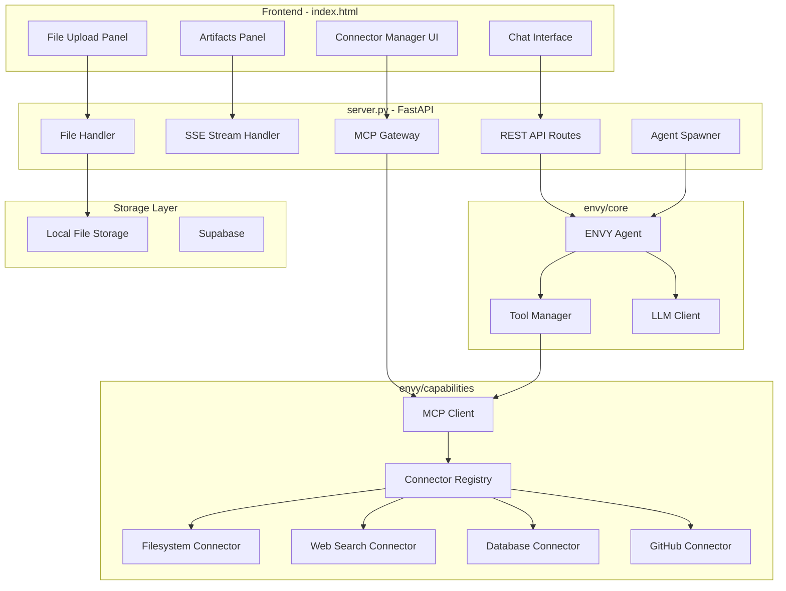
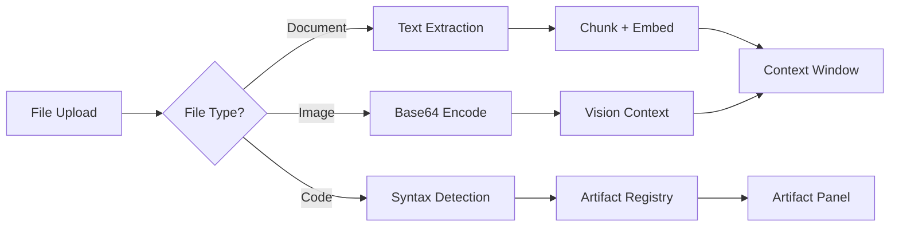
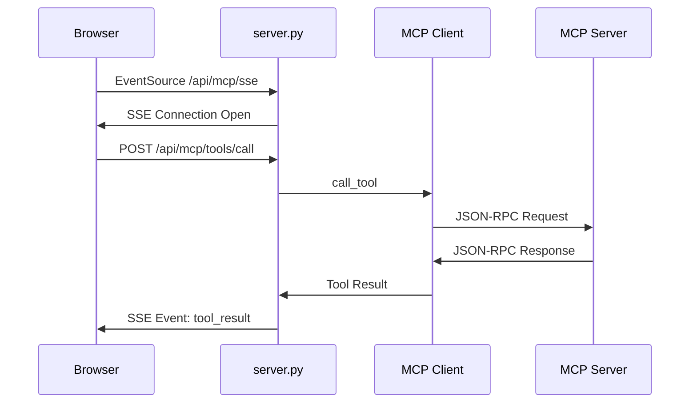
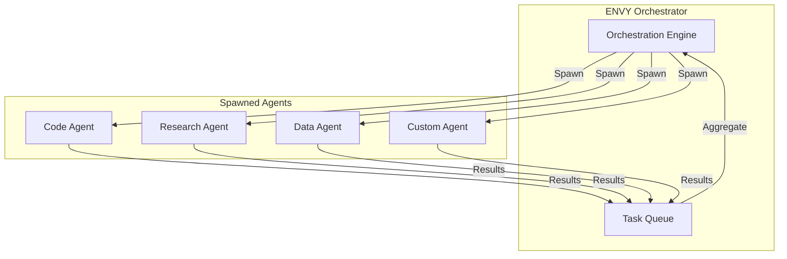

# ENVY Enhanced Capabilities Architecture Plan

## Executive Summary

This document outlines the comprehensive enhancement of ENVY's `server.py` to include:
- **File Upload System** - Support for documents, images, and code files
- **MCP Integration** - Full Model Context Protocol with SSE transport
- **Connectors** - Filesystem, Web Search, Database, GitHub integrations
- **Artifacts UI** - Claude-style dual-pane workspace with sandboxed rendering
- **Agent Spawner** - Ability to create and orchestrate sub-agents

**Key Constraint:** No payment or sign-in pages required.

---

## 1. System Architecture Overview



---

## 2. File Upload System

### 2.1 New Endpoints in server.py

| Endpoint | Method | Purpose |
|----------|--------|---------|
| `/api/files/upload` | POST | Upload single/multiple files |
| `/api/files/{file_id}` | GET | Retrieve file metadata or content |
| `/api/files/{file_id}` | DELETE | Remove uploaded file |
| `/api/files/list` | GET | List all uploaded files in session |

### 2.2 Supported File Types

```python
SUPPORTED_FILE_TYPES = {
    # Documents - for RAG/context injection
    documents: [.pdf, .docx, .txt, .md, .csv, .json],
    
    # Images - for vision analysis
    images: [.png, .jpg, .jpeg, .gif, .webp, .svg],
    
    # Code - for artifact rendering
    code: [.py, .js, .ts, .jsx, .tsx, .html, .css, .sql]
}
```

### 2.3 File Processing Pipeline



### 2.4 Implementation: File Handler Module

**New file: `envy/capabilities/file_handler.py`**

```python
from pathlib import Path
from typing import Optional, Dict, List, Any
import base64
import hashlib
import mimetypes
from dataclasses import dataclass
from enum import Enum

class FileType(Enum):
    DOCUMENT = document
    IMAGE = image
    CODE = code
    UNKNOWN = unknown

@dataclass
class UploadedFile:
    id: str
    filename: str
    file_type: FileType
    mime_type: str
    size_bytes: int
    content: Optional[str] = None  # Text content or base64
    path: Optional[Path] = None
    metadata: Dict[str, Any] = None

class FileHandler:
    def __init__(self, upload_dir: str = ./uploads):
        self.upload_dir = Path(upload_dir)
        self.upload_dir.mkdir(parents=True, exist_ok=True)
        self.files: Dict[str, UploadedFile] = {}
    
    async def process_upload(self, file_bytes: bytes, filename: str) -> UploadedFile:
        # Generate unique ID
        file_id = hashlib.sha256(file_bytes[:1024]).hexdigest()[:16]
        
        # Detect type and process
        mime_type = mimetypes.guess_type(filename)[0] or application/octet-stream
        file_type = self._classify_file(mime_type, filename)
        
        # Process based on type
        if file_type == FileType.IMAGE:
            content = base64.b64encode(file_bytes).decode()
        elif file_type == FileType.DOCUMENT:
            content = await self._extract_text(file_bytes, mime_type)
        elif file_type == FileType.CODE:
            content = file_bytes.decode(utf-8, errors=replace)
        else:
            content = None
        
        # Save to disk
        file_path = self.upload_dir / f{file_id}_{filename}
        file_path.write_bytes(file_bytes)
        
        uploaded = UploadedFile(
            id=file_id,
            filename=filename,
            file_type=file_type,
            mime_type=mime_type,
            size_bytes=len(file_bytes),
            content=content,
            path=file_path
        )
        
        self.files[file_id] = uploaded
        return uploaded
```

---

## 3. MCP Integration Architecture

### 3.1 Transport Layer: SSE for Web Clients

The browser cannot spawn stdio processes. We implement an **SSE Gateway** pattern:



### 3.2 New MCP Endpoints

| Endpoint | Method | Purpose |
|----------|--------|---------|
| `/api/mcp/sse` | GET | SSE stream for real-time MCP events |
| `/api/mcp/connectors` | GET | List all available connectors |
| `/api/mcp/connectors/{id}/connect` | POST | Connect to a specific MCP server |
| `/api/mcp/connectors/{id}/disconnect` | POST | Disconnect from connector |
| `/api/mcp/tools` | GET | List all aggregated tools |
| `/api/mcp/tools/call` | POST | Execute a tool |

### 3.3 Enhanced MCP Client

**Updates to: `envy/capabilities/mcp_client.py`**

```python
from mcp import ClientSession
from mcp.client.sse import sse_client  # For remote servers
from mcp.client.stdio import stdio_client  # For local servers
from typing import AsyncGenerator
import asyncio

class EnhancedMCPClient:
    
    def __init__(self):
        self.sessions: Dict[str, ClientSession] = {}
        self.tools_cache: Dict[str, List[Dict]] = {}
        self._event_queue: asyncio.Queue = asyncio.Queue()
    
    async def connect_sse(self, server_name: str, url: str, headers: Dict = None):
        # For remote MCP servers via HTTP/SSE
        async with sse_client(url, headers=headers) as streams:
            async with ClientSession(*streams) as session:
                await session.initialize()
                self.sessions[server_name] = session
                tools = await session.list_tools()
                self.tools_cache[server_name] = tools.tools
    
    async def connect_stdio(self, server_name: str, command: str, args: List[str]):
        # For local MCP servers
        server_params = StdioServerParameters(command=command, args=args)
        async with stdio_client(server_params) as streams:
            async with ClientSession(*streams) as session:
                await session.initialize()
                self.sessions[server_name] = session
                tools = await session.list_tools()
                self.tools_cache[server_name] = tools.tools
    
    async def stream_events(self) -> AsyncGenerator[Dict, None]:
        # SSE event generator for frontend
        while True:
            event = await self._event_queue.get()
            yield event
    
    async def call_tool(self, server: str, tool: str, args: Dict) -> Any:
        session = self.sessions.get(server)
        if not session:
            raise ValueError(f"Server {server} not connected")
        result = await session.call_tool(tool, args)
        await self._event_queue.put({
            type: tool_result,
            server: server,
            tool: tool,
            result: result
        })
        return result
```

---

## 4. Connector Registry System

### 4.1 Connector Configuration

**New file: `envy/capabilities/connectors/__init__.py`**

```python
from dataclasses import dataclass
from enum import Enum
from typing import Optional, Dict, List, Callable

class ConnectorType(Enum):
    FILESYSTEM = filesystem
    WEB_SEARCH = web_search
    DATABASE = database
    GITHUB = github
    CUSTOM = custom

@dataclass
class ConnectorConfig:
    id: str
    name: str
    type: ConnectorType
    description: str
    icon: str  # Emoji or SVG path
    transport: str  # stdio or sse
    command: Optional[str] = None  # For stdio
    url: Optional[str] = None  # For SSE
    args: Optional[List[str]] = None
    env: Optional[Dict[str, str]] = None
    auth_required: bool = False
    enabled: bool = True

# Pre-configured connectors
BUILTIN_CONNECTORS = {
    filesystem: ConnectorConfig(
        id=filesystem,
        name=Filesystem,
        type=ConnectorType.FILESYSTEM,
        description=Read, write, and manage local files,
        icon=📁,
        transport=stdio,
        command=uvx,
        args=[mcp-server-filesystem, ./uploads]
    ),
    
    brave_search: ConnectorConfig(
        id=brave_search,
        name=Brave Search,
        type=ConnectorType.WEB_SEARCH,
        description=Search the web using Brave Search API,
        icon=🔍,
        transport=stdio,
        command=uvx,
        args=[mcp-server-brave-search],
        env={BRAVE_API_KEY: }  # User must provide
    ),
    
    supabase: ConnectorConfig(
        id=supabase,
        name=Supabase Database,
        type=ConnectorType.DATABASE,
        description=Query and manage Supabase PostgreSQL,
        icon=🗄️,
        transport=sse,
        url=# Derived from settings
    ),
    
    github: ConnectorConfig(
        id=github,
        name=GitHub,
        type=ConnectorType.GITHUB,
        description=Manage repositories, issues, and PRs,
        icon=🐙,
        transport=stdio,
        command=uvx,
        args=[mcp-server-github],
        env={GITHUB_TOKEN: }
    )
}
```

### 4.2 Connector Registry

**New file: `envy/capabilities/connector_registry.py`**

```python
class ConnectorRegistry:
    
    def __init__(self, mcp_client: EnhancedMCPClient):
        self.mcp = mcp_client
        self.configs: Dict[str, ConnectorConfig] = BUILTIN_CONNECTORS.copy()
        self.connected: Dict[str, bool] = {}
    
    def register(self, config: ConnectorConfig):
        self.configs[config.id] = config
    
    async def connect(self, connector_id: str, credentials: Dict = None):
        config = self.configs.get(connector_id)
        if not config:
            raise ValueError(f"Unknown connector: {connector_id}")
        
        # Merge credentials into env
        env = {**(config.env or {}), **(credentials or {})}
        
        if config.transport == stdio:
            await self.mcp.connect_stdio(
                config.id, 
                config.command, 
                config.args,
                env=env
            )
        else:
            await self.mcp.connect_sse(
                config.id,
                config.url,
                headers={Authorization: f"Bearer {env.get(API_KEY, )}"}
            )
        
        self.connected[connector_id] = True
    
    async def disconnect(self, connector_id: str):
        await self.mcp.disconnect(connector_id)
        self.connected[connector_id] = False
    
    def list_connectors(self) -> List[Dict]:
        return [
            {
                **vars(config),
                connected: self.connected.get(config.id, False)
            }
            for config in self.configs.values()
        ]
    
    def get_all_tools(self) -> List[Dict]:
        return self.mcp.get_aggregated_tools()
```

---

## 5. Artifacts UI System

### 5.1 Artifact Types

```python
class ArtifactType(Enum):
    REACT = application/vnd.ant.react
    HTML = text/html
    SVG = image/svg+xml
    MERMAID = application/vnd.ant.mermaid
    CODE = application/vnd.ant.code
    MARKDOWN = text/markdown
```

### 5.2 Artifact Detection in Stream

The LLM is instructed via system prompt to wrap artifacts:

```xml
<antArtifact identifier="unique-id" type="application/vnd.ant.react" title="Component Name">
  // React/HTML/Code content here
</antArtifact>
```

### 5.3 Frontend Artifact Rendering

**Updates to: `static/index.html`**

Key components:
1. **Dual-Pane Layout** - Chat on left, Artifacts on right
2. **Sandboxed iframe** - Secure rendering with `sandbox="allow-scripts"`
3. **Tab Toggle** - Preview vs Code view
4. **Real-time Streaming** - Content appears as generated

```javascript
// Artifact Parser
function parseArtifact(text) {
    const regex = /<antArtifact\s+identifier="([^"]+)"\s+type="([^"]+)"\s+title="([^"]+)"[^>]*>([\s\S]*?)<\/antArtifact>/g;
    const artifacts = [];
    let match;
    
    while ((match = regex.exec(text)) !== null) {
        artifacts.push({
            id: match[1],
            type: match[2],
            title: match[3],
            content: match[4]
        });
    }
    return artifacts;
}

// Sandboxed Renderer
function renderInSandbox(content, type) {
    const iframe = document.getElementById(artifact-frame);
    iframe.srcdoc = buildSandboxHTML(content, type);
}

function buildSandboxHTML(content, type) {
    if (type.includes(react)) {
        return `
            <!DOCTYPE html>
            <html>
            <head>
                <script src="https://unpkg.com/react@18/umd/react.production.min.js"></script>
                <script src="https://unpkg.com/react-dom@18/umd/react-dom.production.min.js"></script>
                <script src="https://unpkg.com/@babel/standalone/babel.min.js"></script>
                <link href="https://cdn.tailwindcss.com" rel="stylesheet">
            </head>
            <body>
                <div id="root"></div>
                <script type="text/babel">
                    ${content}
                    ReactDOM.render(<App />, document.getElementById(root));
                </script>
            </body>
            </html>
        `;
    }
    return content;  // Raw HTML/SVG
}
```

---

## 6. Agent Spawner System

### 6.1 Agent Spawner Architecture

ENVY can spawn specialized sub-agents for complex tasks:



### 6.2 Agent Definition

**New file: `envy/capabilities/agent_spawner.py`**

```python
from dataclasses import dataclass
from typing import List, Dict, Any, Optional
from enum import Enum
import asyncio

class AgentRole(Enum):
    CODER = coder
    RESEARCHER = researcher
    ANALYST = analyst
    WRITER = writer
    CUSTOM = custom

@dataclass
class AgentBlueprint:
    role: AgentRole
    name: str
    system_prompt: str
    tools: List[str]  # Tool names this agent can use
    max_iterations: int = 5
    
AGENT_BLUEPRINTS = {
    coder: AgentBlueprint(
        role=AgentRole.CODER,
        name=Code Agent,
        system_prompt=You are a code specialist. Write clean, efficient code.,
        tools=[run_code, filesystem_read, filesystem_write]
    ),
    researcher: AgentBlueprint(
        role=AgentRole.RESEARCHER,
        name=Research Agent,
        system_prompt=You are a research specialist. Find accurate information.,
        tools=[brave_search, web_fetch]
    ),
    analyst: AgentBlueprint(
        role=AgentRole.ANALYST,
        name=Data Analyst,
        system_prompt=You analyze data and produce insights.,
        tools=[database_query, run_code]
    )
}

class AgentSpawner:
    
    def __init__(self, llm_client, tool_manager):
        self.llm = llm_client
        self.tools = tool_manager
        self.active_agents: Dict[str, dict] = {}
        self.max_concurrent = 5
    
    async def spawn(self, role: str, task: str, context: Dict = None) -> str:
        # Get or create blueprint
        blueprint = AGENT_BLUEPRINTS.get(role)
        if not blueprint:
            blueprint = self._create_custom_blueprint(role)
        
        agent_id = f"agent_{role}_{len(self.active_agents)}"
        
        # Run agent in background
        asyncio.create_task(
            self._run_agent(agent_id, blueprint, task, context)
        )
        
        return agent_id
    
    async def _run_agent(self, agent_id: str, blueprint: AgentBlueprint, task: str, context: Dict):
        self.active_agents[agent_id] = {
            status: running,
            task: task,
            iterations: 0,
            results: []
        }
        
        messages = [
            {role: system, content: blueprint.system_prompt},
            {role: user, content: task}
        ]
        
        for i in range(blueprint.max_iterations):
            response = await self.llm.complete(messages)
            
            # Check for tool calls
            tool_call = self._parse_tool(response.content)
            if tool_call and tool_call[tool] in blueprint.tools:
                result = await self.tools.execute(tool_call[tool], tool_call[args])
                messages.append({role: assistant, content: response.content})
                messages.append({role: user, content: f"Tool result: {result}"})
            else:
                # Final answer
                self.active_agents[agent_id][status] = completed
                self.active_agents[agent_id][result] = response.content
                return
        
        self.active_agents[agent_id][status] = max_iterations
    
    def get_status(self, agent_id: str) -> Dict:
        return self.active_agents.get(agent_id, {status: not_found})
    
    def list_agents(self) -> List[Dict]:
        return [
            {id: aid, **info}
            for aid, info in self.active_agents.items()
        ]
```

### 6.3 Agent Spawner Endpoints

| Endpoint | Method | Purpose |
|----------|--------|---------|
| `/api/agents/spawn` | POST | Spawn a new agent with role and task |
| `/api/agents/{id}` | GET | Get agent status and results |
| `/api/agents` | GET | List all active agents |
| `/api/agents/{id}/stop` | POST | Stop a running agent |
| `/api/agents/blueprints` | GET | List available agent blueprints |

---

## 7. Enhanced server.py Structure

### 7.1 New Imports and Dependencies

```python
# New imports
from fastapi import UploadFile, File, BackgroundTasks
from fastapi.responses import StreamingResponse
from sse_starlette.sse import EventSourceResponse
import aiofiles

# New capability imports
from envy.capabilities.file_handler import FileHandler
from envy.capabilities.connector_registry import ConnectorRegistry
from envy.capabilities.agent_spawner import AgentSpawner
from envy.capabilities.mcp_client import EnhancedMCPClient
```

### 7.2 New Route Groups

```python
# ===================================
# FILE UPLOAD ROUTES
# ===================================

@app.post("/api/files/upload")
async def upload_files(files: List[UploadFile] = File(...)):
    ...

@app.get("/api/files/{file_id}")
async def get_file(file_id: str):
    ...

@app.get("/api/files/list")
async def list_files():
    ...

# ===================================
# MCP & CONNECTORS ROUTES
# ===================================

@app.get("/api/mcp/sse")
async def mcp_sse_stream():
    # SSE endpoint for real-time MCP events
    ...

@app.get("/api/mcp/connectors")
async def list_connectors():
    ...

@app.post("/api/mcp/connectors/{connector_id}/connect")
async def connect_connector(connector_id: str, credentials: Dict = None):
    ...

@app.get("/api/mcp/tools")
async def list_tools():
    ...

@app.post("/api/mcp/tools/call")
async def call_tool(tool_name: str, args: Dict):
    ...

# ===================================
# AGENT SPAWNER ROUTES
# ===================================

@app.post("/api/agents/spawn")
async def spawn_agent(role: str, task: str, context: Dict = None):
    ...

@app.get("/api/agents/{agent_id}")
async def get_agent(agent_id: str):
    ...

@app.get("/api/agents")
async def list_agents():
    ...

# ===================================
# CAPABILITIES & HEALTH
# ===================================

@app.get("/api/capabilities")
async def get_capabilities():
    # Returns all system capabilities
    ...
```

---

## 8. Frontend Enhancements

### 8.1 File Upload UI

```html
<!-- File Upload Button & Preview -->
<div id="upload-section" class="flex gap-2 px-2 pb-2">
    <input type="file" id="file-input" multiple hidden accept="*/*">
    <button onclick="document.getElementById('file-input').click()" 
            class="p-2 text-zinc-400 hover:text-zinc-200 rounded-lg">
        <svg><!-- Upload icon --></svg>
    </button>
    <div id="file-previews" class="flex gap-1 overflow-x-auto"></div>
</div>
```

### 8.2 Connector Management Panel

```html
<!-- Connector Panel (in sidebar) -->
<div id="connector-panel" class="p-4 border-t border-zinc-800">
    <h3 class="text-sm font-semibold text-zinc-400 mb-2">Connectors</h3>
    <div id="connector-list" class="space-y-2">
        <!-- Dynamic connector buttons -->
    </div>
</div>
```

### 8.3 Agent Status Panel

```html
<!-- Agent Status (floating panel) -->
<div id="agent-panel" class="fixed bottom-4 right-4 bg-zinc-900 rounded-lg shadow-xl">
    <div class="p-3 border-b border-zinc-800 flex justify-between">
        <span class="font-semibold">Active Agents</span>
        <span id="agent-count" class="bg-orange-600 px-2 rounded text-xs">0</span>
    </div>
    <div id="agent-list" class="p-2 max-h-64 overflow-y-auto">
        <!-- Agent status cards -->
    </div>
</div>
```

---

## 9. Implementation Order

### Phase 1: Foundation
1. Create `envy/capabilities/file_handler.py`
2. Add file upload endpoints to `server.py`
3. Update frontend with upload UI

### Phase 2: MCP Infrastructure
4. Enhance `envy/capabilities/mcp_client.py` with SSE support
5. Create `envy/capabilities/connector_registry.py`
6. Add MCP endpoints to `server.py`
7. Implement builtin connectors (Filesystem first)

### Phase 3: Artifacts UI
8. Update `static/index.html` with dual-pane layout
9. Implement artifact detection and parsing
10. Build sandboxed iframe renderer

### Phase 4: Agent System
11. Create `envy/capabilities/agent_spawner.py`
12. Add agent endpoints to `server.py`
13. Update frontend with agent status panel

### Phase 5: Integration & Polish
14. Connect all components in ENVY agent
15. Update Tool Manager with new capabilities
16. Test end-to-end flows
17. Error handling and edge cases

---

## 10. New Dependencies

Add to `requirements.txt`:

```
# File Processing
python-multipart>=0.0.6
aiofiles>=23.2.0
PyPDF2>=3.0.0
python-docx>=1.0.0

# SSE
sse-starlette>=1.6.0

# MCP Enhanced
mcp>=1.0.0

# Agent Background Tasks
asyncio>=3.4.3
```

---

## 11. Security Considerations

1. **File Upload Limits**
   - Max file size: 50MB
   - Allowed types whitelist
   - Virus scanning hook

2. **Artifact Sandbox**
   - iframe with `sandbox="allow-scripts"`
   - Separate origin for content
   - CSP headers

3. **MCP Tool Execution**
   - Tool whitelist per session
   - Rate limiting
   - Audit logging

4. **Agent Isolation**
   - Resource limits per agent
   - Timeout enforcement
   - No cross-agent data access

---

## 12. Success Metrics

- [ ] User can upload any supported file type
- [ ] Files are processed and available as context
- [ ] MCP connectors can be connected/disconnected
- [ ] Tools from connectors are available to ENVY
- [ ] Artifacts render in real-time during generation
- [ ] Agents can be spawned and monitored
- [ ] All operations work without auth
